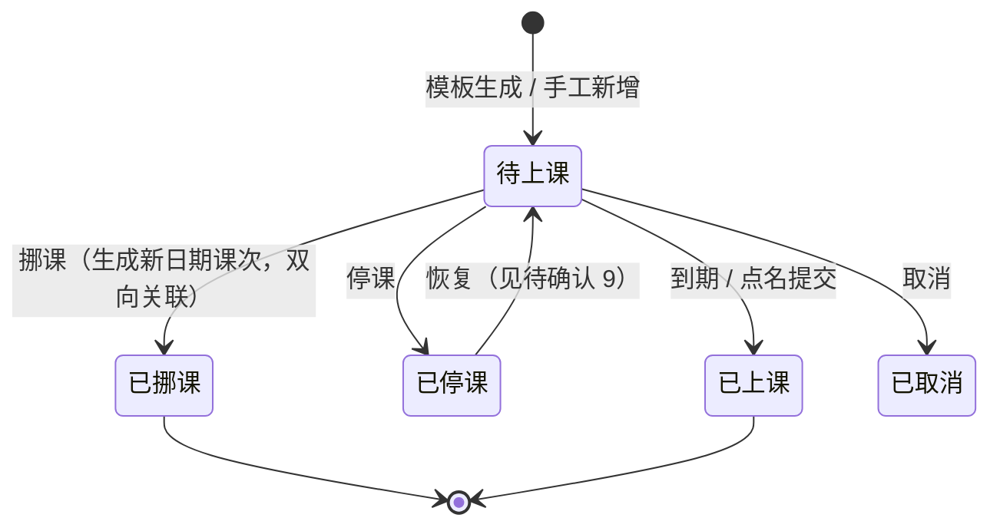
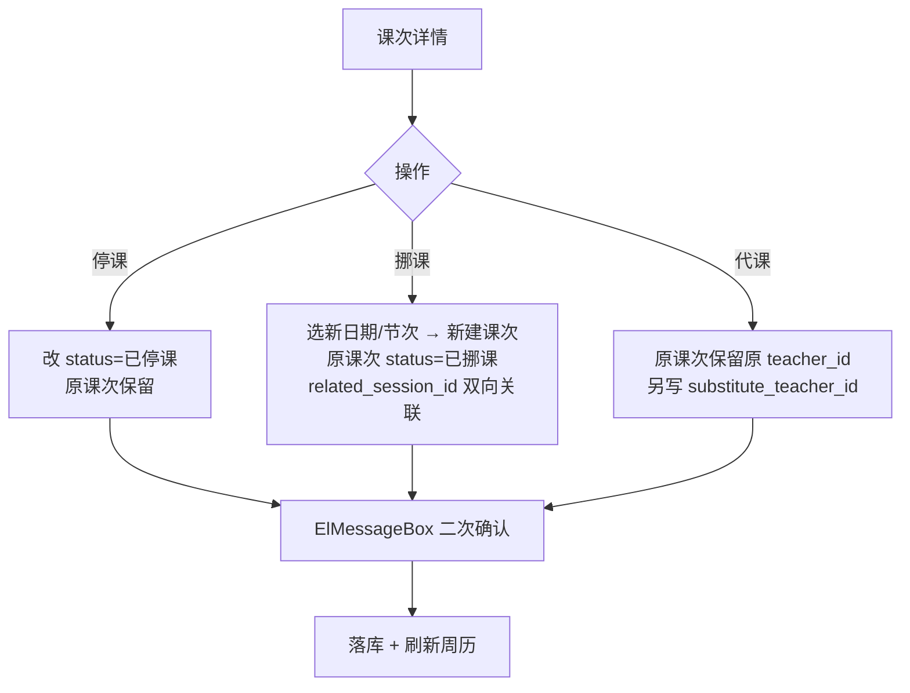
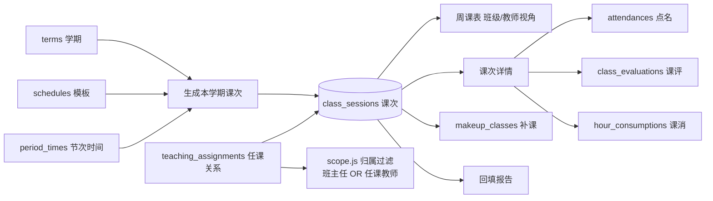

> 术语修订 2026-09-24：本文档中「调课」已统一改称「挪课」（指**只挪某一节**），以区别于 `数据管理 → 调课审批`（改长期排课模板）。数据库状态值同步由迁移 v22 完成。

# 课次实体与任课关系 · 增量 PRD（G1 + G2）

> **本文只描述本次变更**（G1 课次实体 + G2 任课关系），不重写全系统。
> 权威需求来源：`ROADMAP.md` §七之四。**8 项拍板结论 + 3 项补充决策不再重复论证，本文只做细化，不推翻。**
> 技术栈：前端 Vue 3.5 + TS + Vite + Element Plus（pure-admin-thin）；后端 Express 4 + `node:sqlite` + JWT；DB 基线 **v20**。

---

## 1. 产品目标

系统当前只有**「排课模板」**（`schedules`：班级 × 星期几 × 节次），**没有「课次实例」**（2026-09-23 周三第 3 节这一节具体的课）。后果是：教室冲突、代课、停课、教学进度**全都没有载体**；考勤与课评的唯一键是 `(学员, 课程, 日期)`，导致**「同一课程同一天两节」第二节课签不进**（功能缺陷）；课时消耗挂不到具体课次，**与家长对账只能"按日期大致对"**；且系统里**根本没有「谁教哪个班哪门课」这张表**，任课教师看不到自己教的班（功能级故障）。

**本次目标**：**先补上「课次实例」这块地基，并顺手解决由它派生的任课关系缺口**——让排课治理（F4 代课 / F5 停课 / F6 教室 / F7 批量排课）与作业登记有一个稳定的、可审计的连接键；让老师能看到自己任课班级的教学数据；让历史数据尽量归位、归不了位的**显式可见**而不是静默丢失。

**三个正交目标**
1. **可承载**：每一节真实发生的课都有独立、稳定的课次 ID，考勤 / 课消 / 课评 / 补课全部改挂它。
2. **可指认**：明确「谁教哪个班哪门课」，任课教师登录后能看见自己的班（仅教学类）。
3. **可交接**：历史数据尽力回填、失败项显式成报告；停课 / 挪课 / 代课**保留原课次 + 状态标记 + 双向关联**，历史可追溯。

---

## 2. 用户故事

| # | 角色 | 故事 | 对应需求 |
|---|---|---|---|
| US1 | 管理员 | 作为管理员，我希望**选学期点一下就把整学期课次生成出来**（先给我看到会生成多少节再确认），以便不用每周手动补课次 | 生成课次 |
| US2 | 管理员 / 教师 | 作为使用者，我希望**打开课表就看到这一周的真实课次**（按周历时间网格排列，班级 / 教师两个视角可切），以便一眼看清谁在什么时候上什么课 | 周课表 |
| US3 | 管理员 | 作为管理员，我希望**能停掉某一天某一节课、或把它调到另一个日期**，原课次保留下来并标好状态、两边互相能点过去，以便事后能查清"这节课为什么没上/挪到哪了" | 停课 / 挪课 |
| US4 | 管理员 | 作为管理员，我希望**能指定某人代某节课**，原老师与代课人**都记录在案**，以便算工作量与追责时有据可查 | 代课 |
| US5 | 管理员 | 作为管理员，我希望**维护「班级 × 课程 × 教师」的任课关系**，以便系统知道每门课谁在上，而不是靠课程上的一段文本 | 任课关系维护 |
| US6 | 教师 | 作为教师，我希望**登录后只看到我任课班级的课表 / 考勤 / 成绩 / 作业 / 课评**（看不到财务与招生线索），以便我专心教我的班 | 任课教师看自己的班 |
| US7 | 管理员 | 作为管理员，我希望**看到历史数据回填的结果**（哪些匹配上了、哪些没匹配上、为什么），并**把没匹配上的项一键转成待办**，以便数据缺口不被静默掩盖 | 回填报告 |
| US8 | 教师 | 作为教师，我希望**点名时不用额外填课次**——系统已经知道我在给哪节课点名，点完顺手就能评课，以便录入不额外增加负担 | 采集铁律 |

---

## 3. 需求池（P0 本期必做 / P1 应做 / P2 后续）

> 优先级口径：**P0 = 本期交付**；P1 = 本期若有余量或紧随其后；P2 = 明确延后（多数已写进 Non-goals）。
> 所有 P0 条目合并验收，验收标准见 `ROADMAP.md` §七之四·三（9 条）。

### 3.1 P0（本期必做）

| ID | 需求 | 说明 / 验收要点 | 依赖 |
|---|---|---|---|
| **G1-P0-1** | `class_sessions` 课次实例表 | 迁移 **v21**（版本连续递增）；字段见 §4.1；唯一键 `(class_id, session_date, period)`；`term_id` 见待确认 2 | — |
| **G1-P0-2** | `teaching_assignments` 任课关系表 | 「班级 × 课程 × 教师(可空) × 学期」；见 §4.1 | — |
| **G1-P0-3** | `period_times` 节次时间表 | **独立表**（结构化配置，非 `settings` KV）；第 N 节 → 起止时间；课次据此带真实 `start_time/end_time` | G1-P0-1 |
| **G1-P0-4** | 既有 4 表挂 `session_id` + 重建唯一键 | `attendances`·`hour_consumptions`·`class_evaluations`·`makeup_classes` 加 `session_id`；**重建 `attendances` 与 `class_evaluations` 的唯一键**（改为挂课次）；走项目既有表重建模式（v2/v10/v14 先例）+ 迁移前后**行数比对** | G1-P0-1 |
| **G1-P0-5** | 历史数据回填 | 按「班级+课程+日期」反查课次回填；**映射不上的置空并显式进报告**，不阻断；失败率过高触发 ADR-009 复审条件 1 | G1-P0-1 |
| **G1-P0-6** | 生成本学期课次（手工 + 预览） | 「生成本学期课次」= 选学期 → **预览节数** → 确认；重复策略见待确认 1 | G1-P0-1/3 |
| **G1-P0-7** | **周课表页**（班级 / 教师两视角 · 时间网格） | **必须用周历时间网格，禁止列表**；自绘 CSS Grid，零新依赖；冲突 / 停课 / 挪课视觉标识；详见 §4.2 | G1-P0-1/6 |
| **G1-P0-8** | 课次详情 | 点名 / 课评 / 课消 / 挪课记录 四页签；入口嵌在既有流程里；详见 §4.3 | G1-P0-4/7 |
| **G1-P0-9** | 停课 / 挪课 / 代课 | **保留原课次 + 状态标记**：停课=改状态；挪课=新建新日期课次 + 原课次标「已挪课」+ **双向关联**；代课=原课次保留原教师 + 另记代课人 | G1-P0-1 |
| **G1-P0-10** | 任课关系维护页 | CRUD；班级 × 课程 × 教师；详见 §4.5 | G1-P0-2 |
| **G1-P0-11** | 回填报告页 | 可筛选列表（班级 / 日期 / 原因）+ **一键转待办**；详见 §4.6 | G1-P0-5 |
| **G2-P0-1** | 归属过滤扩展 | `server/src/utils/scope.js` 归属过滤改为「**班主任 OR 任课教师**」；`schedules`·`exams`·`classes`·`dashboard`·`leaves`·`adjustments` 同步 | G1-P0-2 |
| **G2-P0-2** | 任课教师可见范围 | **仅教学类**（课表 / 考勤 / 成绩 / 作业 / 课评）；**不可见财务与招生线索**；用**双角色对照验证**（项目既有 `verify-*.mjs` 做法） | G2-P0-1 |
| **G1-P0-12** | `DEDUCT_STATUSES` 集中读取点 | 现硬编码在 `server/src/routes/attendance.js:108`（`["正常","迟到","早退"]`）→ **抽成集中读取点，不改行为**（为 G14 规则矩阵铺垫） | — |
| **G1-P0-13** | 采集嵌入既有流程 | 课次相关录入**不得新开"去填课次"入口**；点名 / 课评在既有页面内自动带出当前课次；**课次详情 = 既有流程的聚合视图，不是新表单** | G1-P0-4/8 |

### 3.2 P1（应做，本期余量或紧随其后）

| ID | 需求 | 说明 |
|---|---|---|
| G1-P1-1 | 手工新增课次（加课 / 补课） | `origin = 手工/补课`，`schedule_id` 可空；供临时加课、补课登记用 |
| G1-P1-2 | 课次批量操作 | 批量停课（如整周停课）；批量代课（教师请假场景，衔接 G20） |
| G1-P1-3 | 周历快捷操作 | 「跳到本周 / 今天」「上一周 / 下一周」；是否做"复制上周"见待确认 8 |
| G1-P1-4 | 课次检索（辅助） | 按学期 / 班级 / 教师 / 状态检索课次，供导出与对账；**仅辅助检索，不替代周历主呈现** |
| G1-P1-5 | 课次状态流转 | 到期自动由「待上课」→「已上课」；停课课次阻止点名的规则见待确认 9 |

### 3.3 P2（明确延后 / 写进 Non-goals）

| ID | 需求 | 归属 |
|---|---|---|
| G1-P2-1 | 教室资源表 + 三重冲突检测（班级 / 教师 / 教室） | → F6，本期**只留 `room_id` 可空字段** |
| G1-P2-2 | 考勤 × 课消规则矩阵**配置页** | → G14，本期只做集中读取点 |
| G1-P2-3 | 周历**教室视角** | 本次只做班级 / 教师两视角 |
| G1-P2-4 | 移动端适配 | → P2 |
| G1-P2-5 | 教学大纲 / 进度录入界面 | `topic` 字段**仅留位**，不做界面 |
| G1-P2-6 | 课次导出（xlsx / PDF） | → 统一导出中心 G18 |

---

## 4. 技术规范

### 4.1 数据模型（增量）

> 权威字段定义以 `server/database.md` 为准，此处只列本次新增/变更。

**新增 `class_sessions`（课次实例）** —— 一节真实发生的课

| 字段 | 类型 | 说明 |
|---|---|---|
| `id` | INTEGER PK | 全系统教学事件的连接键 |
| `term_id` | INTEGER FK → terms | **建议新增**（待确认 2），便于按学期筛选 / 生成 |
| `schedule_id` | INTEGER FK → schedules | 来源模板（可空：手工加课 / 补课为空） |
| `class_id` / `course_id` | INTEGER FK | 班级 / 课程 |
| `teacher_id` | INTEGER FK → users | **本节课授课教师**（代课时仍为原教师） |
| `substitute_teacher_id` | INTEGER FK → users | **代课人**（拍板结论 5；可空） |
| `room_id` | INTEGER | 教室（**可空**，本次不建资源表，拍板结论 7） |
| `session_date` | TEXT | **具体日期**（模板里没有的那一维） |
| `period` | INTEGER | 节次 |
| `start_time` / `end_time` | TEXT | 起止时间，取自 `period_times` |
| `status` | TEXT | `待上课` / `已上课` / `已停课` / `已挪课` / `已取消` |
| `origin` | TEXT | `模板生成` / `挪课` / `补课` / `手工` |
| `related_session_id` | INTEGER FK → class_sessions | **挪课双向关联**（原↔新，可空） |
| `topic` | TEXT | 本次教学主题（**仅留位**，不建录入界面） |

- 唯一约束：`(class_id, session_date, period)`
- 索引：`(class_id, session_date)`、`(teacher_id, session_date)`

**新增 `teaching_assignments`（任课关系）**

| 字段 | 说明 |
|---|---|
| `id` | PK |
| `class_id` / `course_id` | 班级 / 课程 |
| `teacher_id` | 任课教师（引用 `users`，**可空**以兼容未定教师） |
| `term_id` | 学期（可空 = 长期有效） |
| `created_at` / `updated_at` | 时间戳 |

- 唯一约束：`(class_id, course_id, term_id)`

**新增 `period_times`（节次时间表）**

| 字段 | 说明 |
|---|---|
| `id` | PK |
| `period` | 节次序号（唯一） |
| `start_time` / `end_time` | 如 `08:00` / `08:45` |
| `label` | 显示名（如"第 1 节"，可空回落） |

- 唯一约束：`period`

**既有表变更**

| 表 | 变更 | 迁移处理 |
|---|---|---|
| `attendances` | + `session_id`；**重建唯一键** 由 `(student_id, course_id, date)` → 挂课次 | 反查回填；回填不上置空 + 进报告 |
| `hour_consumptions` | + `session_id` | 同上（**课消精确对账关键**） |
| `class_evaluations` | + `session_id`；**重建唯一键** | `session_no` 由课次推算，不再手填 |
| `makeup_classes` | + `original_session_id` / `makeup_session_id` | 由日期字符串改为课次引用 |
| `schedules` | **不改**（语义降级为「排课模板」，模板与实例并存） | — |

**课次状态机**



### 4.2 ★ UI 设计稿 · 周课表页（`src/views/attendance/sessions/index.vue`）

> **呈现方式铁律**：排课是**时间占用型**功能 → **必须用周历时间网格，禁止用列表 / 表格**。
> **实现**：自绘 **CSS Grid**（拍板补充 2，零新依赖），沿用 Element Plus + 全局 token。
> **骨架一致**：与 `schedules/index.vue`、`checkin/index.vue` 同风格（`AppPageHeader` + 卡片 + Tailwind 工具类）。

```
┌─ .app-page ───────────────────────────────────────────────────────────────────┐
│ ┌─ AppPageHeader ───────────────────────────────────────────────────────────┐  │
│ │ 课次课表                         [ 生成本学期课次 ](el-button primary)     │  │
│ │ 按周查看每个班级 / 教师的真实课次（含起止时间与状态）                     │  │
│ └───────────────────────────────────────────────────────────────────────────┘  │
│                                                                                │
│ ┌─ .page-card ──────────────────────────────────────────────────────────────┐  │
│ │ ┌─ .page-toolbar ───────────────────────────────────────────────────────┐ │  │
│ │ │ 视角(el-radio-group)  班级/教师(el-select)                            │ │  │
│ │ │  ◉ 班级   ○ 教师      [三年级奥数A班 ▾]                               │ │  │
│ │ │                       [ ‹ 上周 ]  2026-09-23 ~ 09-29  [ 本周 ]  [ 下周 › ] │ │  │
│ │ │ 状态筛选(el-select 多选: 待上课/已停课/已挪课)      [今天]             │ │  │
│ │ └───────────────────────────────────────────────────────────────────────┘ │  │
│ │                                                                            │  │
│ │  ┌──────────┬──────────┬──────────┬──────────┬──────────┬───┬──────────┐  │  │
│ │  │ 时间轴   │ 周一 23  │ 周二 24  │ 周三 25  │ 周四 26  │…  │ 周日 29  │  │  │
│ │  ├──────────┼──────────┼──────────┼──────────┼──────────┼───┼──────────┤  │  │
│ │  │ 第1节    │          │          │          │          │   │          │  │  │
│ │  │08:00-45  │          │          │          │          │   │          │  │  │
│ │  ├──────────┼──────────┼──────────┼──────────┼──────────┼───┼──────────┤  │  │
│ │  │ 第2节    │┌────────┐│          │┌────────┐│          │   │          │  │  │
│ │  │08:55-40  ││奥数基础││          ││阅读写作││          │   │          │  │  │
│ │  │          ││张老师  ││          ││李老师 ⚠││  ← 冲突 │   │          │  │  │
│ │  │          ││302 教室││          │└────────┘│          │   │          │  │  │
│ │  │          │└────────┘│          │          │          │   │          │  │  │
│ │  ├──────────┼──────────┼──────────┼──────────┼──────────┼───┼──────────┤  │  │
│ │  │ 第3节    │          │          │┌╌╌╌╌╌╌╌╌┐│          │   │          │  │  │
│ │  │10:00-45  │          │          │╎英语(已调╎│          │   │          │  │  │
│ │  │          │          │          │╎课→26日) ╎│          │   │          │  │  │
│ │  │          │          │          │└╌╌╌╌╌╌╌╌┘│          │   │          │  │  │
│ │  └──────────┴──────────┴──────────┴──────────┴──────────┴───┴──────────┘  │  │
│ │        （无课次的格子留空；点空格 = 本次不做手工加课，见 P1）              │  │
│ └───────────────────────────────────────────────────────────────────────────┘  │
└────────────────────────────────────────────────────────────────────────────────┘
```

**课次卡片（单元格内）元素清单**

| 元素 | 内容 | 数据来源 |
|---|---|---|
| 课程名 | 主标题，`.text-[13px] font-medium` | `course_id → courses.name` |
| 授课教师 | 副行；代课时追加「代课：王老师」 | `teacher_id` / `substitute_teacher_id` |
| 教室 | `302 教室` / `未指定`（空值回落） | `room_id`（本期多数为空） |
| 起止时间 | 卡底小字 `08:55–09:40` | `period_times` 快照 |
| 状态徽标 | `el-tag`：待上课(info) · 已上课(success) · 已停课(danger/灰) · 已挪课(warning) · 已取消(info) | `status` |
| 冲突标识 | **红色左边框 + ⚠ 图标**（教师视角同格 ≥2 张卡 / 未来 F6 教室冲突） | 前端基于全量课次计算 |
| 点击 | 打开**课次详情**（§4.3） | — |

**状态 → 视觉映射**

| 状态 | 视觉 | 交互 |
|---|---|---|
| 待上课 | 白底 + `--brand-100` 浅底 + 品牌色左边框 | 可点开、可停课/挪课/代课 |
| 已上课 | 实心 + 绿点（`--status-success`） | 可点开看记录 |
| 已停课 | 灰底 + **删除线** + 灰 tag | 只读；可「恢复」（待确认 9） |
| 已挪课 | **虚线边框** + warning tag + 「→ 26日」角标 | 点击跳**新课次** |
| 冲突 | 红左边框 + ⚠ + hover 提示冲突双方 | 只提示不阻断（本期不做教室冲突） |

**复用的 Element Plus 组件与骨架类**
- 骨架类：`.app-page` · `.page-card` · `.page-toolbar` · `.page-toolbar__spacer` · `.card-head` · `.num` · `.page-hint`
- 组件：`AppPageHeader` · `AppEmpty` · `el-radio-group` / `el-radio-button`（视角切换）· `el-select` / `el-option` · `el-button` · `el-tag` · `el-tooltip` · `el-icon`（`~icons/ep/warning`）· `el-card shadow="never"` · `v-loading`
- **周历网格为自绘 CSS Grid**，无现成组件（项目零日历组件）；样式一律走 `tokens.scss` 变量，**禁止硬编码色值**（视觉规范 §2 硬约束 3）。

### 4.3 ★ UI 设计稿 · 课次详情（抽屉，`el-drawer`）

> 定位：**既有流程的聚合视图**，不是新表单。点名 / 课评复用既有实现，只是"已经知道是哪节课"。

```
┌─ el-drawer "课次详情" (width min(560px, 100vw-32px)) ─────────────────────┐
│ 周三 2026-09-25 · 第2节 08:55–09:40              [el-tag: 待上课]         │
│ 班级：三年级奥数A班    课程：奥数基础    教室：302                        │
│ 授课教师：张老师        代课：—                                          │
│ ─────────────────────────────────────────────────────────────────────── │
│ ┌─ el-tabs ────────────────────────────────────────────────────────────┐ │
│ │ [ 点名 ] [ 课评 ] [ 课消 ] [ 挪课记录 ]                              │ │
│ │                                                                      │ │
│ │  点名：学员名单 + 考勤状态（复用 checkin 页表格写法）                │ │
│ │    ┌──┬────────┬──────┬──────────┬──────────────┐                   │ │
│ │    │# │ 学号   │ 姓名 │ 考勤状态 │ 备注         │                   │ │
│ │    │1 │ S001   │ 王.. │[正常 ▾]  │ [输入]       │                   │ │
│ │    └──┴────────┴──────┴──────────┴──────────────┘                   │ │
│ │    [全部设为正常]                    [批量提交](el-button success)   │ │
│ │                                                                      │ │
│ │  课评：三维评分（专注度 / 参与度 / 掌握度，1–5）全班默认良好          │ │
│ │  课消：本课次课时流水（只读，来源 hour_consumptions.session_id）      │ │
│ │  挪课记录：原课次 ↔ 新课次 双向可跳转（related_session_id）           │ │
│ └──────────────────────────────────────────────────────────────────────┘ │
│ ─────────────────────────────────────────────────────────────────────── │
│ [ 停课 ]  [ 挪课 ]  [ 代课 ]      ← 危险操作，走 ElMessageBox 二次确认    │
└──────────────────────────────────────────────────────────────────────────┘
```

**复用的 Element Plus 组件与骨架类**
- `el-drawer`（替代 `el-dialog` 承载详情，避免遮挡周历上下文）· `el-tabs` / `el-tab-pane` · `el-table` · `el-select` · `el-input` · `el-rate` 或 `el-radio-group`（1–5 评分）· `el-descriptions`（头部信息）· `el-tag` · `ElMessageBox.confirm`（停课 / 挪课二次确认）
- **不新建"去填课次"入口**：本抽屉由周课表 / 考勤登记 / 课评页跳入，课次上下文自动带出。

**停课 / 挪课 / 代课交互流**



### 4.4 ★ UI 设计稿 · 生成本学期课次（预览确认流程）

> 拍板结论 3：**手工触发 + 可预览**。三步一弹窗，不在周历页直接生成。

```
┌─ el-dialog "生成本学期课次" (width min(620px, 100vw-32px)) ───────────────┐
│  Step ① 选择学期                                                          │
│    学期  [ 2026 秋季学期 ▾ ]   ← el-select（terms 表）                    │
│ ─────────────────────────────────────────────────────────────────────── │
│  Step ② 预览                                                              │
│    ┌──────────────────────────────────────────────────────────────────┐  │
│    │ 学期范围    2026-09-01 ~ 2027-01-15（共 20 周）                   │  │
│    │ 参与班级    12 个          排课模板 8 条                          │  │
│    │ 预计生成    480 节课次                                            │  │
│    │ ⚠ 已存在    60 节（重复策略见「待确认 1」）                      │  │
│    │ ⚠ 时间缺失  第 7、8 节未配置节次时间 → 起止时间置空              │  │
│    └──────────────────────────────────────────────────────────────────┘  │
│ ─────────────────────────────────────────────────────────────────────── │
│  Step ③ 确认                                                             │
│                                    [ 取消 ]   [ 确认生成 ](primary)       │
└──────────────────────────────────────────────────────────────────────────┘
```

- 组件：`el-dialog` · `el-select` · `el-alert`（`type="warning"` 提示已存在 / 时间缺失）· `el-descriptions`（预览清单）· `.stat-grid`（可选的摘要指标卡）
- 生成成功 → `ElMessage.success` + 跳转"确认后所在周"的周课表。

### 4.5 ★ UI 设计稿 · 任课关系维护页（`src/views/attendance/teaching-assignments/index.vue`）

```
┌─ .app-page ───────────────────────────────────────────────────────────────┐
│ ┌─ AppPageHeader ───────────────────────────────────────────────────────┐ │
│ │ 任课关系                                    [ 新增任课关系 ](primary)  │ │
│ │ 维护「班级 × 课程 × 教师」，任课教师可据此看到自己的教学数据          │ │
│ └───────────────────────────────────────────────────────────────────────┘ │
│ ┌─ .page-card .page-card--flush ────────────────────────────────────────┐ │
│ │ ┌─ .page-toolbar ───────────────────────────────────────────────────┐ │ │
│ │ │ [班级 ▾] [教师 ▾] [学期 ▾]   [搜索]        .page-toolbar__spacer  │ │ │
│ │ └───────────────────────────────────────────────────────────────────┘ │ │
│ │ ┌──┬──────────────┬──────────┬──────────┬──────────┬───────────────┐ │ │
│ │ │# │ 班级         │ 课程     │ 任课教师 │ 生效学期 │ 操作          │ │ │
│ │ │1 │ 三年级奥数A │ 奥数基础 │ 张老师   │ 2026秋   │ [编辑] [删除] │ │ │
│ │ │2 │ 三年级奥数A │ 阅读写作 │ 李老师   │ 2026秋   │ [编辑] [删除] │ │ │
│ │ └──┴──────────────┴──────────┴──────────┴──────────┴───────────────┘ │ │
│ │  <AppEmpty 空态：还没维护任课关系 / 下一步：新增一条，老师即可看到自己的班>│ │
│ └───────────────────────────────────────────────────────────────────────┘ │
│ 新增弹窗：el-dialog → 班级 · 课程 · 教师(可空) · 学期                    │
└────────────────────────────────────────────────────────────────────────────┘
```

- 组件 / 骨架：`AppPageHeader` · `AppEmpty` · `.page-card--flush` · `.page-toolbar` · `el-table`（`border stripe`，数字列 `.num`）· `el-dialog` · `el-form` / `el-form-item` · `el-select` · `el-pagination`（`.page-card__footer`）
- 写法照抄 `views/attendance/users/index.vue`（`AppPageHeader` + 表格 + 弹窗）与 `schedules/index.vue`。

### 4.6 ★ UI 设计稿 · 回填报告页（`src/views/attendance/sessions/migration-report.vue`）

> 拍板补充 3：**页面展示即可**（可筛选列表：班级 / 日期 / 原因，支持**一键转待办**），不另做 xlsx 下载。

```
┌─ .app-page ───────────────────────────────────────────────────────────────┐
│ ┌─ AppPageHeader title="课次回填报告"  meta: [el-tag danger 未匹配 23]  ─┐ │
│ │ 历史考勤 / 课消 / 课评 反查课次的结果；未匹配项可一键转待办            │ │
│ └───────────────────────────────────────────────────────────────────────┘ │
│ ┌─ .stat-grid ──────────────────────────────────────────────────────────┐ │
│ │ [已匹配 1204]        [未匹配 23]        [回填失败率 1.9%]              │ │
│ └───────────────────────────────────────────────────────────────────────┘ │
│ ┌─ .page-card .page-card--flush ────────────────────────────────────────┐ │
│ │ ┌─ .page-toolbar ───────────────────────────────────────────────────┐ │ │
│ │ │ [数据类型▾] [班级▾] [日期范围] [原因▾]  [搜索]                    │ │ │
│ │ └───────────────────────────────────────────────────────────────────┘ │ │
│ │ ┌────────┬──────────────┬────────────┬──────┬────────────┬──────────┐ │ │
│ │ │ 数据类型│ 班级        │ 日期       │ 学员 │ 原因       │ 操作     │ │ │
│ │ │ 考勤   │ 三年级奥数A │ 2026-06-12 │ 王.. │ 当天无课次 │ [转待办] │ │ │
│ │ │ 课消   │ 二年级英语  │ 2026-05-30 │ 李.. │ 课程不匹配 │ [转待办] │ │ │
│ │ └────────┴──────────────┴────────────┴──────┴────────────┴──────────┘ │ │
│ │  <AppEmpty 空态：全部回填成功 / 下一步：无需处理>                      │ │
│ └───────────────────────────────────────────────────────────────────────┘ │
└────────────────────────────────────────────────────────────────────────────┘
```

- 组件 / 骨架：`AppPageHeader`（`meta` slot 放徽标）· `.stat-grid` / `.stat-card--danger` · `.page-card--flush` · `.page-toolbar` · `el-table` · `el-date-picker`（范围）· `el-tag` · `el-button link`（转待办）· `AppEmpty`
- **一键转待办**：调用既有 `POST /api/todos`（L2 已落地），指派对象见待确认 6。

### 4.7 需求 → 界面 → 数据链路总览



### 4.8 边界（Non-goals，**本期明确不做**）

❌ 教室资源表与三重冲突检测（→ P2 / F6）· ❌ 规则矩阵配置页（→ P1 / G14，本期只抽集中读取点）· ❌ 走班排课 · ❌ 自动排课算法 · ❌ 周历教室视角 · ❌ 教学大纲 / 进度录入界面（`topic` 仅留位）· ❌ 移动端适配（→ P2）
❌ 不引入新角色（维持 `admin` / `teacher` 双角色）· ❌ 不做"新开一个去填课次"的入口（采集铁律）

---

## 5. 待确认问题

> 以下为拍板结论中**存在歧义或留有缺口**的点，**不自行假设**，请主理人 / 业务方确认后再进入开发。

| # | 问题 | 备选方案 | 影响 |
|---|---|---|---|
| Q1 | **重复生成课次的策略**：拍板只说"选学期 → 预览节数 → 确认"，未定"已存在课次"如何处理 | A. 跳过已存在（幂等，推荐）<br>B. 覆盖已存在（丢失手工改动风险）<br>C. 报错阻断 | 决定生成接口语义与预览页文案 |
| Q2 | **`class_sessions` 是否加 `term_id`**：ADR-009 字段列表未含学期 | A. 加（推荐，按学期筛选/生成更稳）<br>B. 不加（靠日期范围反查） | 影响表结构与所有课次查询 |
| Q3 | **节次上限**：现 `schedules.period` 与前端硬编码均为 **1–8 节** | A. 沿用固定 8 节<br>B. 放开为可配任意节数 | 决定 `period_times` 是否允许 >8 行及 CHECK 约束是否放宽 |
| Q4 | **挪课后原课次的考勤 / 课消数据**：拍板定了"新建新课次 + 双向关联"，但未说原课次上**已录入**的考勤 / 课消是否随之迁移 | A. 一并迁移到新课次<br>B. 保留在原课次（历史留痕） | 影响"已挪课"课次的点名校验与对账口径 |
| Q5 | **代课人的可见与录入权**：原课次 `teacher_id` 保持原教师，另记代课人；但**代课人能否看到该课次、能否录本次考勤 / 课评**未定 | A. 代课人可看可录（推荐）<br>B. 仅原教师可录 | 影响 `scope.js` 过滤条件与考勤录入入口 |
| Q6 | **回填报告"一键转待办"的指派对象** | A. 仅 admin（校区负责人）<br>B. 班主任 + admin<br>C. 手工选择 | 决定转待办时 `assignee` 取值 |
| Q7 | **考勤唯一键重建后的空值处理**：历史 `session_id` 回填失败的记录会为空，唯一键含空值时的约束行为需明确 | A. 允许空值（SQLite UNIQUE 对 NULL 不约束，需显式确认）<br>B. 保留原 `(student_id, course_id, date)` 作退路键 | 影响迁移脚本与重复签到校验 |
| Q8 | **周历默认视角与周基准**：进入页面默认按什么呈现、教师视角是否自动锁定当前登录教师未定 | A. 默认班级视角 + 今天所在周<br>B. 教师角色默认自动锁定本人 | 影响首次进入体验与接口默认参数 |
| Q9 | **停课 → 恢复**是否支持，以及**停课课次是否阻止点名 / 课消** | A. 支持恢复 + 停课阻止点名<br>B. 停课仅标记，不阻断 | 影响状态机与点名校验 |

---

## 5.1 决议（**9 问已全部闭环**，2026-09-23）

> 由主理人裁定 7 条 + 业务方拍板 3 条。**架构师以本表为最终口径，不再沿用 §5 的"备选方案"。**

| # | 决议 | 裁定人 | 理由 |
|---|---|---|---|
| **Q1** | **跳过已存在（幂等）**；预览必须显示「将新增 N 节 / 已存在 M 节跳过」 | 主理人 | 覆盖会破坏已录考勤/课评，违反「保留原课次」与 ADR-011 只增不改 |
| **Q2** | **`class_sessions` 加 `term_id`** | 主理人 | 生成按学期触发；周课表/报表按学期筛；成本一个列 + 索引 |
| **Q3** | **节次上限保持 1–8**；`period_times` 只可配 1–8 节的时间 | 业务方 | 8 节/天足够；改上限需重建 `schedules` 表（CHECK），风险/收益不划算 |
| **Q4** | **只允许 `status='待上课'` 的课次挪课**；已上课（已点名/已扣课）不可调，提示走补课流程 | 业务方（确认） | 挪课是"计划变更"，不应搬动已发生的事实；从根源消除"考勤是否迁移"的争议 |
| **Q5** | **代课人可看可录，仅限他代的那一节**（`scope.js` 增加一条按 `substitute_teacher_id` 的课次级可见条件）；仍只限教学类 | 业务方 | 否则课上完没人能记，代课形同虚设；额度极小、安全 |
| **Q6** | **转待办仅指派 admin**，转后可由 admin 手动改指派人 | 主理人 | 回填是教务管理动作；复用 `todos` 既有指派能力 |
| **Q7** | **双条件唯一索引**：`session_id IS NULL` → 保留 `UNIQUE(student_id, course_id, date)`；`session_id` 非空 → `UNIQUE(session_id, student_id)` | 主理人 | SQLite 的 UNIQUE 不约束 NULL，历史行会失去去重保护；条件索引两头都保住 |
| **Q8** | **默认班级视角 + 今天所在周**；`teacher` 登录默认切「教师视角」并锁定本人 | 主理人 | 老师大概率只想看自己 |
| **Q9** | **停课支持恢复（带留痕）**；**停课状态阻止点名与课消** | 主理人 | 课没上就不该产生考勤 |
| **补充** | **生成时按日期定初始状态**：`session_date < 今天` → `已上课`；`>= 今天` → `待上课` | 主理人 | 否则整学期生成出来都是"待上课"，与事实不符 |

---

## 6. 验收对齐（引用，不重复）

本次 9 条验收标准见 `ROADMAP.md` §七之四·三；本文各 P0 条目的"验收要点"列为其拆解。
回归门槛：`e2e-lifecycle.mjs` 80/80 · `analytics-smoke.mjs` 22/22 · `pnpm lint:eslint` 0 error · `pnpm build` 退出码 0。
