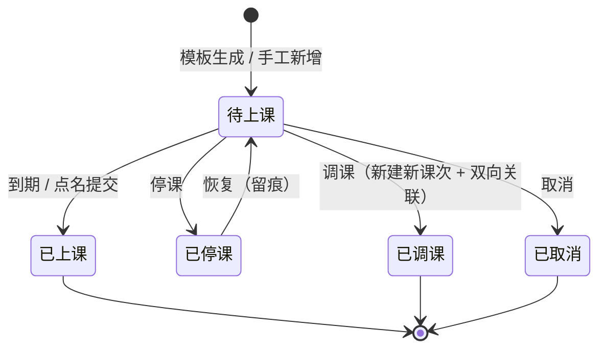
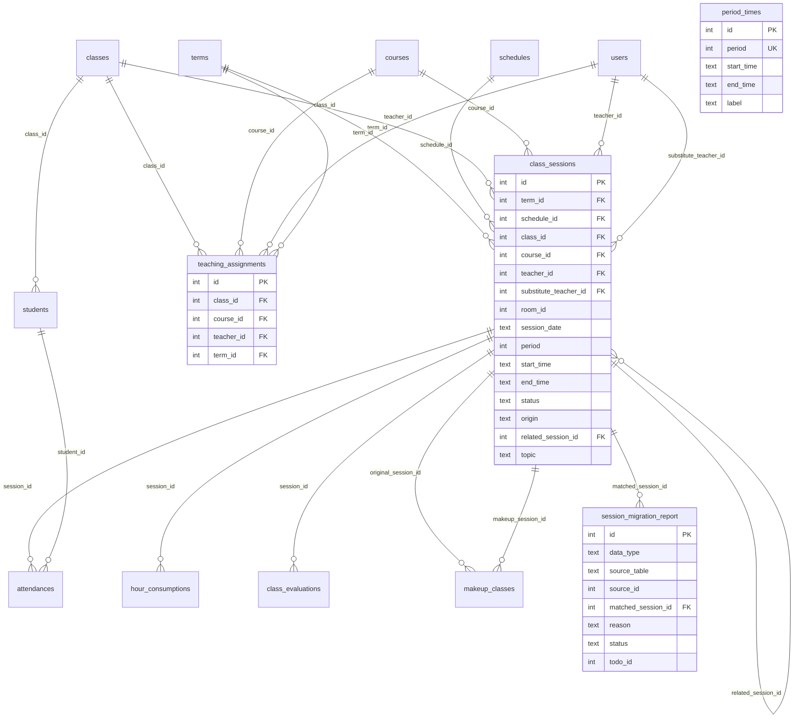
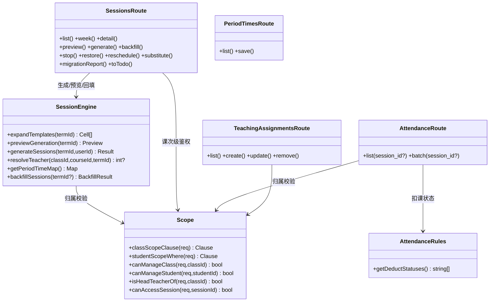
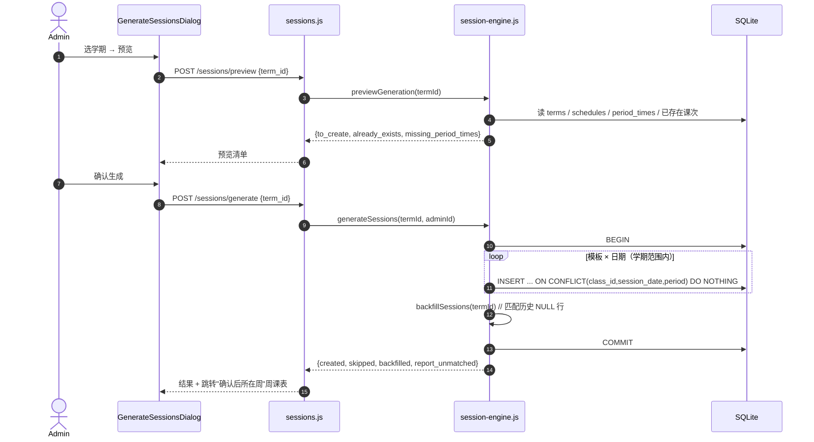
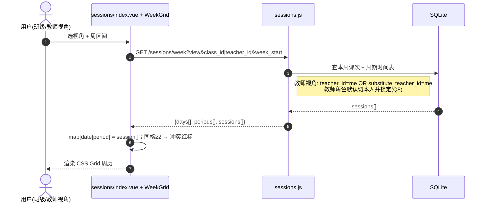
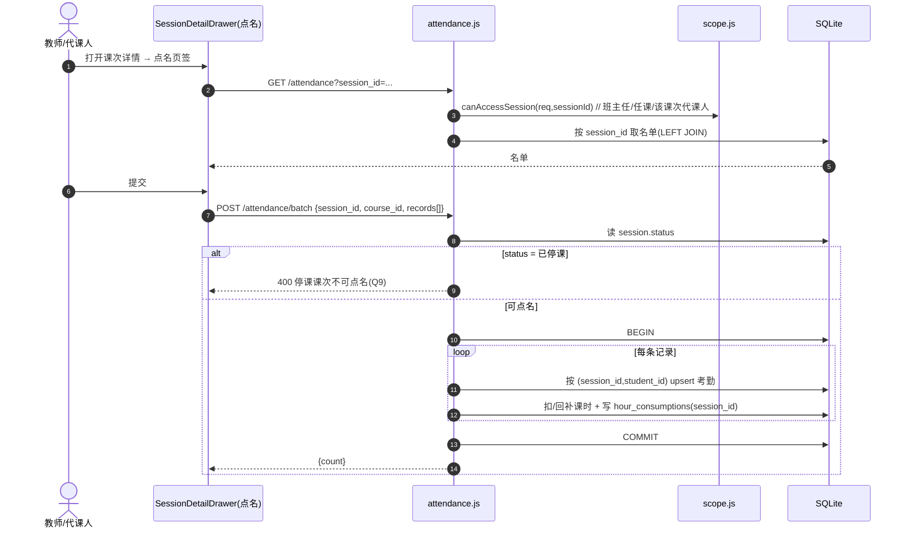
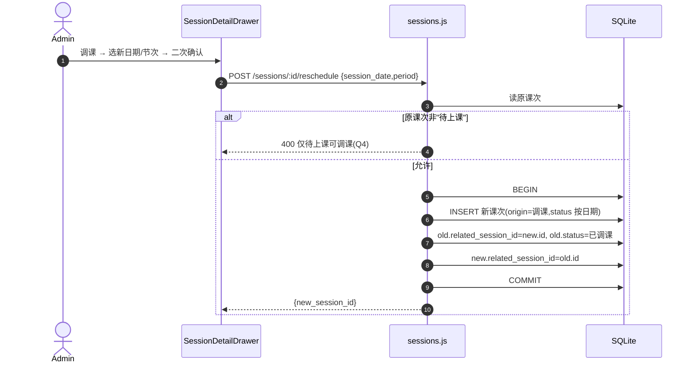
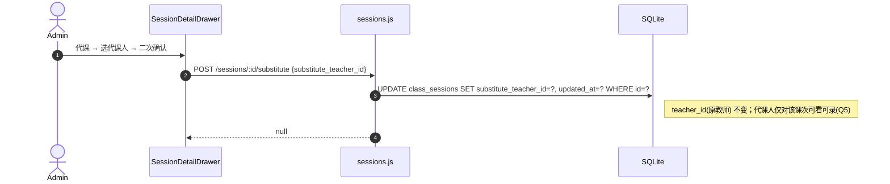
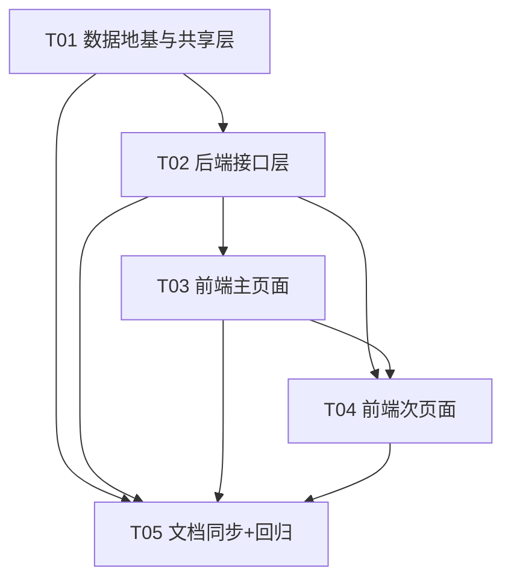

# 课次实体与任课关系 · 系统设计与任务分解

> 本文是 G1（课次实体）+ G2（任课关系）的**设计与施工图**。所有口径以 **PRD §5.1 决议** 与 **ROADMAP §七之四** 为准，本文不推翻。
> 已实际打开并核对：`001/003/004/005/006/011/012/014/018` 迁移、`attendance.js`、`schedules.js`、`scope.js`、`classes.js`、`growth.js`、`makeups.js`、`todos.js`、`terms.js`、`settings.js`、`auth.js`、`index.js`、`middleware/auth.js`、`db.js` 及三份前端基准页与 `page.scss / tokens.scss`。

---

## Part A：系统设计

### 1. 实现方案与技术选型

#### 1.1 核心难点与总体思路

本项是**地基型增量**：新增「课次实例」这一教学事件枢纽，并把考勤 / 课消 / 课评 / 补课改挂它。难度**不在算法，而在"改数据地基不伤历史"**。落点：

| 难点 | 结论 |
|---|---|
| 唯一键语义变更（考勤/课评） | 走项目既有**表重建模式**（v14 先例）+ **双条件（部分）唯一索引** 保住历史去重（Q7） |
| 历史数据无课次可挂 | **迁移只加列**；**回填独立成"生成后匹配"步骤**（幂等、可重跑、失败显式进报告） |
| 生成整学期（可能数千行） | 单事务 + `INSERT ... ON CONFLICT DO NOTHING`（**Q1 幂等跳过**），`node:sqlite` 同步驱动一次事务跑完 |
| 权限扩展不能漏财务/线索 | 财务 / 线索路由**本就是 `requireRole("admin")`**（实测确认），扩 `scope.js` 不会外溢 |
| 周历零新依赖 | **自绘 CSS Grid**（拍板补充 2），数据由**单接口一次取全**，前端按 `日期|节次` 建 map，杜绝 N+1 |
| 节次时间改历史 | **生成时快照写入课次**（不联表取），日后改 `period_times` 不回写历史 |

#### 1.2 关键设计问题（6 条的明确结论）

**★ 问题 1：`attendances` / `class_evaluations` 唯一键重建方案**

采用 **Q7 双条件唯一索引**，保留两张旧表的结构化重建（走 v14 模式）。核心 SQL（完整见 §3.1）：

```sql
-- 逻辑等价于：session_id 为空 → 旧键仍生效；session_id 非空 → 挂课次去重
CREATE UNIQUE INDEX ux_attendance_legacy  ON attendances(student_id, course_id, date) WHERE session_id IS NULL;
CREATE UNIQUE INDEX ux_attendance_session ON attendances(session_id, student_id)         WHERE session_id IS NOT NULL;
```

- **NULL 处理**：SQLite 的 UNIQUE 不约束 NULL，若不建条件索引，历史行（`session_id IS NULL`）会**失去去重保护**。条件索引两头都保住（Q7 原话）。
- **历史行回填**：迁移**不**回填（此时尚无课次）；回填在「生成本学期课次」后的独立步骤执行（§1.2 问题 4）。因此迁移阶段全部历史行 `session_id IS NULL`，落入 legacy 索引分区。
- **行数比对**：重建前后 `COUNT(*)` 必须相等，不等即抛错回滚（迁移内断言）。
- **外键校验**：迁移末尾 `PRAGMA foreign_key_check`，非空即抛错（沿用 v11/v14 模式）。

**受影响的既有查询 / 接口（语义变化清单）** —— 只有下面 3 处是**语义**变化，其余全为**加列不改义**：

| 位置 | 现状 | 变更后 |
|---|---|---|
| `attendance.js` `POST /batch` 的 `ON CONFLICT(student_id, course_id, date)` | 依赖表级 UNIQUE | **拆两路**：传 `session_id` → 按 `(session_id, student_id)` 手动 select→insert/update；未传 → 走 **legacy 部分索引**（保持 e2e 行为，见 §3.2） |
| `growth.js` `POST /class-eval` 的 `ON CONFLICT(student_id, course_id, eval_date)` | 依赖表级 UNIQUE | 同上拆两路（传 `session_id` → 按 `(session_id, student_id)`） |
| `schedules.js` `checkConflicts` 的"同教师"文本级检测 | 比 `courses.teacher`（文本） | **改为按任课关系**（`teaching_assignments` / 课次 `teacher_id`），G2 落地后的正解 |

其余（`/attendance` 名单、`/attendance/records`、`/statistics*`、`/warnings`、`growth /eval-form`、`timeline.js`、`todo-generator.js`、`courses.js`、`finance.js`、`analytics.js`、`makeups.js`）**全部按 `date` 查询，继续工作，`session_id` 为纯增量列**。

**★ 问题 2：`scope.js` 归属过滤扩展 + 调用点清单 + "仅教学类"保证**

把「班主任 `classes.head_teacher_id`」扩为「**班主任 OR 任课教师**」（`teaching_assignments`）。**课次级代课人可见**（Q5）是**课次维度**条件，不进 `scope.js` 班级过滤（避免整班越权），单独在 `sessions.js` / `attendance.js` 的 session 分支实现。

新 `scope.js` 谓词（教师角色）：
```sql
-- 班级归属：班主任 OR 任课教师
c.head_teacher_id = :me
  OR EXISTS (SELECT 1 FROM teaching_assignments ta WHERE ta.class_id = c.id AND ta.teacher_id = :me)
```

**必须同步的调用点（含 `attendance.js` 内的本地副本）**：

| 文件 | 需改点 | 改法 |
|---|---|---|
| `utils/scope.js` | `classScopeClause` / `studentScopeWhere` / `canManageClass` / `canManageStudent` | 谓词扩展（唯一权威） |
| `routes/attendance.js` | **第 14–17 行本地 `classScopeClause`（删除，改 import）**；第 249、373、532 行内联 `c.head_teacher_id = ?` | 统一改用 `utils/scope` |
| `routes/adjustments.js` | 第 33、59 行内联 | 改用 `classScopeClause(req)` |
| `routes/exams.js` | 第 20 行内联 | 同上 |
| `routes/dashboard.js` | 第 19、36、41 行内联 | 同上 |
| `routes/leaves.js` | 第 16、121（回显字段保留）行内联 | 第 16 行改用 scope；121 行 `head_teacher_id` 仅作展示且后续用 `canManageStudent` 兜底，保留 |
| `routes/makeups.js` | 第 22 行内联 | 改用 `classScopeClause(req)` |
| `routes/notifications.js` | 第 14、97 行内联 | 同上 |
| `routes/schedules.js` / `classes.js` / `students.js` / `growth.js` | 已用 `classScopeClause` / `studentScopeWhere` / `canManage*` | **改 `scope.js` 后自动生效，无需逐个改** |

**"仅教学类"如何保证**：**靠角色门禁，不靠归属过滤**。
- `routes/finance.js`（`requireRole("admin")`，实测 15 个端点全部如此）与 `routes/leads.js`（全部 `requireRole("admin")`）**保持不动** → 教师根本无法触达财务与招生线索，扩 `scope.js` 不会外溢。
- 其余保持 `requireRole("admin")` 不动、本次**不开放**给 teacher 的路由：`routes/period-times.js` 的写端点、`routes/teaching-assignments.js` 全部、`routes/sessions.js` 的生成 / 停课 / 调课 / 代课 / 回填 / 报告端点（详见 §3.2 权限列）。
- **一处定向收窄（决策）**：`classes.js` 的 **DELETE** 是"删班"这类破坏操作，不属教学动作；建议删除时额外要求**班主任**身份（新增 `isHeadTeacherOf(req, classId)`）。此为最小且明确的安全加固，不推翻任何拍板结论。

**★ 问题 3：`period_times` 与课次 `start_time/end_time` 的关系 → 生成时快照**

**选择：生成时把 `start_time/end_time` 快照写入 `class_sessions`**（不联表取）。
理由：
1. **历史不可篡改**（ADR-008 §9 / v18「只增不改」）：日后调整第 3 节时间，**不得改写** 2026-09 已发生的课次时间。
2. 冲突判断 / 时长计算在**无联表**下即可完成，周历渲染快。
3. `period_times` 未配置该节次时，快照写入空串（前端回落"未设置"），不阻断生成（对应 §4.4 "时间缺失" 提示）。

**★ 问题 4：课次生成的事务与幂等**

- **幂等（Q1 跳过已存在）**：`INSERT INTO class_sessions(...) SELECT ... ON CONFLICT(class_id, session_date, period) DO NOTHING`，`changes` 即新增数；已存在不计、不覆盖 → 已录考勤 / 课评不被破坏。
- **事务**：整个生成（模板×日期 展开）+ 随后的**回填**包在**一个 `BEGIN/COMMIT`** 内；异常 `ROLLBACK` 抛出（沿用项目事务写法）。
- **性能**：`node:sqlite` 是同步驱动，数千行预编译语句循环在单事务内执行，**无网络往返**，量级为毫秒级；`ADR-009 复审条件 2`（>24000 行）才需评估分区，本期不做。
- **预览**（拍板结论 3）：`POST /sessions/preview` 做**纯计算、只读**，返回 `{ to_create, already_exists, classes, templates, missing_period_times:[...] }`。预览与执行**共用同一个展开函数**，保证"预览到的=将生成的"。
- **生成时定初始状态（补充决策）**：`session_date < 今天` → `已上课`；`>= 今天` → `待上课`（用 `date('now','localtime')` 比较）。
- **回填**：生成后立即对三张表（考勤 / 课消 / 课评）中 `session_id IS NULL` 的**历史行**做匹配回填（按 `class_id + course_id + session_date` 反查课次）。**恰好 1 条**→回填；**0 条**→进报告（原因"当天无对应课次"）；**>1 条**→进报告（原因"同日同课程多个课次，无法唯一确定"）。回填**幂等**（`session_migration_report` 建 `UNIQUE(source_table, source_id)`）且**可重跑**（独立端点 `POST /sessions/backfill`）。

**★ 问题 5：`related_session_id` 双向关联且不成环**

- 仅 **`status='待上课'`** 可调课（Q4）：生成新课次 `origin='调课'`、`status` 按日期规则，写 `old.related_session_id = new.id`、`new.related_session_id = old.id`（**同一事务**内）。
- **不成环的保证**：`已调课` 是**终止态**（不再可被调），所以每个课次在关联链上**至多出边为 1**；且调课**只从 `待上课` 出发**、目标是**新建的孤立节点**（其 `related` 必为 NULL）。故关联图恒为若干**独立二元对**，**结构上不可能成环**。
- 防御：调课前断言 `new` 尚不存在（新建）、`old.status==='待上课'`、`old.related_session_id IS NULL`。

**★ 问题 6：前端周历网格的数据形状（一次取全）**

`GET /sessions/week` 返回**渲染整张网格所需的全部数据**，前端零额外请求：

```jsonc
{
  "week_start": "2026-09-23", "week_end": "2026-09-29",
  "days":    [{ "date":"2026-09-23", "day_of_week":3, "label":"周三", "is_today":true }, /* ×7 周一→周日 */],
  "periods": [{ "period":1, "label":"第1节", "start_time":"08:00", "end_time":"08:45" }, /* 1..8 */],
  "sessions":[{ "id":12, "class_id":3, "class_name":"三年级奥数A班",
               "course_id":5, "course_name":"奥数基础",
               "teacher_id":7, "teacher_name":"张老师",
               "substitute_teacher_id":null, "substitute_teacher_name":null,
               "room_id":null, "session_date":"2026-09-23", "period":2,
               "start_time":"08:55","end_time":"09:40",
               "status":"待上课", "origin":"模板生成",
               "related_session_id":null,"related_date":null }]
}
```

前端 `computed` 建 `map[session_date + '|' + period] = session[]`（教师视角同格 ≥2 张即"冲突"），**冲突标识在前端算**（同 §4.2，本期不做教室冲突）。**教师视角** `teacher_id=me OR substitute_teacher_id=me`（Q5/Q8）；**班级视角** `class_id` 必填。

#### 1.3 技术选型

| 层 | 选型 | 依据 |
|---|---|---|
| DB 迁移 | 复用 `migrations/0NN-*.js` + `PRAGMA user_version` 执行器 | **零新依赖**；版本号 **v21 起连续** |
| 后端 | Express 4 + `node:sqlite`（同步）+ `jsonwebtoken` + `bcryptjs` | 既有栈，**零新依赖** |
| 前端 | Vue 3.5 + TS + Element Plus + `dayjs`（既有） | **零新依赖**；周历**自绘 CSS Grid** |
| 样式 | 复用 `page.scss`（`.app-page/.page-card/.page-toolbar/.stat-grid/.stat-card--*`）+ `tokens.scss` 变量 | 视觉规范硬约束，**禁硬编码色值** |

---

### 2. 文件清单（相对路径）

**后端 · 新增**

| 文件 | 职责 |
|---|---|
| `server/src/migrations/021-sessions-assignments.js` | v21：建 `period_times` / `teaching_assignments` / `class_sessions` / `session_migration_report`；重建 `attendances`、`class_evaluations`；`hour_consumptions` / `makeup_classes` 加列；行数比对 + `foreign_key_check` |
| `server/src/utils/session-engine.js` | 课次引擎：`expandTemplates()`（预览/执行共用）、`previewGeneration()`、`generateSessions()`、`resolveTeacher()`、`getPeriodTimeMap()`、`backfillSessions()` |
| `server/src/utils/attendance-rules.js` | `DEDUCT_STATUSES` 集中读取点（`getDeductStatuses()`），行为不变（G1-P0-12） |
| `server/src/routes/sessions.js` | 课次路由：列表 / 周视图 / 详情 / 预览 / 生成 / 回填 / 报告 / 停课 / 恢复 / 调课 / 代课 / 手工新增 |
| `server/src/routes/teaching-assignments.js` | 任课关系 CRUD |
| `server/src/routes/period-times.js` | 节次时间表 读取 + 批量保存 |

**后端 · 修改**

| 文件 | 改动 |
|---|---|
| `server/src/migrations/index.js` | 注册 `021` |
| `server/src/utils/scope.js` | 4 个谓词扩展为「班主任 OR 任课教师」；新增 `isHeadTeacherOf`、`canAccessSession`（代课课次级） |
| `server/src/routes/attendance.js` | 删本地 `classScopeClause`；`GET /` 支持 `session_id`；`POST /batch` 支持 `session_id`（拆两路 + 停课阻断 + 代课人可录）；`DEDUCT_STATUSES` 改读集中点；内联归属改 scope |
| `server/src/routes/growth.js` | `POST /class-eval` 支持 `session_id`，upsert 拆两路 |
| `server/src/routes/schedules.js` | `checkConflicts` 的"同教师"由文本级改为按 `teaching_assignments` |
| `server/src/routes/auth.js` | `ROUTES` 菜单：admin 加 4 项、teacher 加 1 项（周课表） |
| `server/src/index.js` | 挂载 3 个新路由 + `AUDIT_MODULES` 增 3 条前缀 |
| `server/database.md` | v21 版本历史 + 表结构同步 |

**前端 · 新增**

| 文件 | 职责 |
|---|---|
| `src/api/sessions.ts` | 课次 / 任课关系 / 节次时间 / 回填报告 全部接口函数（集中在此，views 内不出现 axios） |
| `src/views/attendance/sessions/index.vue` | 周课表页（骨架：`AppPageHeader` + `.app-page`/`.page-card`/`.page-toolbar`） |
| `src/views/attendance/sessions/components/WeekGrid.vue` | **自绘 CSS Grid** 周历（`grid-template-columns: 88px repeat(7, 1fr)`） |
| `src/views/attendance/sessions/components/SessionDetailDrawer.vue` | 课次详情抽屉（点名 / 课评 / 课消 / 调课记录 四页签） |
| `src/views/attendance/sessions/components/GenerateSessionsDialog.vue` | 生成课次三步弹窗（选学期 → 预览 → 确认） |
| `src/views/attendance/sessions/migration-report.vue` | 回填报告页（`.stat-grid` + 可筛选列表 + 一键转待办） |
| `src/views/attendance/teaching-assignments/index.vue` | 任课关系维护页（表格 + 弹窗，照抄 `users/index.vue` 骨架） |
| `src/views/attendance/period-times/index.vue` | 节次时间表配置页（1–8 节 起止时间） |

**前端 · 修改**

| 文件 | 改动 |
|---|---|
| `src/api/attendance.ts` | 考勤名单/批量接口新增 `session_id` 可选参数说明；补充 session 相关导出（如需） |

**文档 / 测试**

| 文件 | 动作 |
|---|---|
| `server/docs/021-课次实体与任课关系-设计.md` | 本文件（设计交付物） |
| `docs/04-API/API.md` | 同步新接口（权威） |
| `docs/04-API/openapi.yaml` | 同步新接口（跑 `check-openapi.mjs`） |
| `server/scripts/verify-sessions.mjs` | **新增**：双角色对照验证（admin 全量 / teacher 仅教学类，且**不可见财务/线索**，对齐项目既有 `verify-*.mjs` 做法） |
| `server/scripts/e2e-lifecycle.mjs` | 追加"课次"阶段回归（可选，用于 9 条验收 4/7 自动化） |

---

### 3. 数据结构与接口

#### 3.1 新增 / 变更表完整 DDL（迁移 v21）

```sql
-- ── 1) 节次时间表（独立表，非 settings KV）──────────────────────────────
CREATE TABLE period_times (
  id         INTEGER PRIMARY KEY AUTOINCREMENT,
  period     INTEGER NOT NULL UNIQUE CHECK (period BETWEEN 1 AND 8),   -- Q3：保持 1–8
  start_time TEXT NOT NULL DEFAULT '',                                  -- HH:mm
  end_time   TEXT NOT NULL DEFAULT '',                                  -- HH:mm
  label      TEXT NOT NULL DEFAULT '',                                  -- 显示名，空则回落「第N节」
  updated_at TEXT NOT NULL DEFAULT (datetime('now','localtime'))
);
-- 预置 1..8 默认时间（admin 可在页面改；不占额外迁移）
INSERT INTO period_times (period, start_time, end_time, label) VALUES
  (1,'08:00','08:45','第1节'),(2,'08:55','09:40','第2节'),
  (3,'10:00','10:45','第3节'),(4,'10:55','11:40','第4节'),
  (5,'14:00','14:45','第5节'),(6,'14:55','15:40','第6节'),
  (7,'16:00','16:45','第7节'),(8,'16:55','17:40','第8节');

-- ── 2) 任课关系（班级 × 课程 × 教师 × 学期）────────────────────────────
CREATE TABLE teaching_assignments (
  id         INTEGER PRIMARY KEY AUTOINCREMENT,
  class_id   INTEGER NOT NULL REFERENCES classes(id) ON DELETE CASCADE,
  course_id  INTEGER NOT NULL REFERENCES courses(id) ON DELETE CASCADE,
  teacher_id INTEGER REFERENCES users(id)   ON DELETE SET NULL,   -- 可空：未定教师
  term_id    INTEGER REFERENCES terms(id)   ON DELETE CASCADE,    -- 可空=长期有效
  created_at TEXT NOT NULL DEFAULT (datetime('now','localtime')),
  updated_at TEXT NOT NULL DEFAULT (datetime('now','localtime')),
  UNIQUE (class_id, course_id, term_id)                            -- PRD 口径
);
-- 加固：term_id 可空时 SQLite UNIQUE 不约束 NULL，补一条部分唯一索引防"长期有效"重复
CREATE UNIQUE INDEX ux_ta_no_term ON teaching_assignments(class_id, course_id) WHERE term_id IS NULL;
CREATE INDEX idx_ta_class   ON teaching_assignments(class_id);
CREATE INDEX idx_ta_teacher ON teaching_assignments(teacher_id);

-- ── 3) 课次实例 ────────────────────────────────────────────────────────
CREATE TABLE class_sessions (
  id                    INTEGER PRIMARY KEY AUTOINCREMENT,
  term_id               INTEGER REFERENCES terms(id)      ON DELETE SET NULL,  -- Q2：加 term_id
  schedule_id           INTEGER REFERENCES schedules(id)  ON DELETE SET NULL,  -- 来源模板（手工/补课可空）
  class_id              INTEGER NOT NULL REFERENCES classes(id) ON DELETE CASCADE,
  course_id             INTEGER NOT NULL REFERENCES courses(id) ON DELETE CASCADE,
  teacher_id            INTEGER REFERENCES users(id) ON DELETE SET NULL,       -- 本节授课教师（代课仍为原教师）
  substitute_teacher_id INTEGER REFERENCES users(id) ON DELETE SET NULL,       -- 代课人（可空）
  room_id               INTEGER,                                               -- 教室（可空，本期不建资源表）
  session_date          TEXT NOT NULL,                                         -- YYYY-MM-DD
  period                INTEGER NOT NULL CHECK (period BETWEEN 1 AND 8),
  start_time            TEXT NOT NULL DEFAULT '',                              -- 生成时快照（取自 period_times）
  end_time              TEXT NOT NULL DEFAULT '',
  status                TEXT NOT NULL DEFAULT '待上课'
                          CHECK (status IN ('待上课','已上课','已停课','已调课','已取消')),
  origin                TEXT NOT NULL DEFAULT '模板生成'
                          CHECK (origin IN ('模板生成','调课','补课','手工')),
  related_session_id    INTEGER REFERENCES class_sessions(id) ON DELETE SET NULL, -- 调课双向关联
  topic                 TEXT NOT NULL DEFAULT '',                              -- 仅留位，不做录入界面
  created_at            TEXT NOT NULL DEFAULT (datetime('now','localtime')),
  updated_at            TEXT NOT NULL DEFAULT (datetime('now','localtime')),
  UNIQUE (class_id, session_date, period)                                      -- 验收标准 2
);
CREATE INDEX idx_cs_date          ON class_sessions(session_date);
CREATE INDEX idx_cs_class_date    ON class_sessions(class_id, session_date);
CREATE INDEX idx_cs_teacher_date  ON class_sessions(teacher_id, session_date);
CREATE INDEX idx_cs_sub_teacher   ON class_sessions(substitute_teacher_id, session_date);
CREATE INDEX idx_cs_term          ON class_sessions(term_id);

-- ── 4) 回填报告（只落"未匹配"，"已匹配"由差值算，避免海量匹配行）────────
CREATE TABLE session_migration_report (
  id                 INTEGER PRIMARY KEY AUTOINCREMENT,
  data_type          TEXT NOT NULL CHECK (data_type IN ('考勤','课消','课评')),
  source_table       TEXT NOT NULL,       -- attendances / hour_consumptions / class_evaluations
  source_id          INTEGER NOT NULL,
  class_id           INTEGER, course_id INTEGER, student_id INTEGER,
  date               TEXT NOT NULL DEFAULT '',
  matched_session_id INTEGER REFERENCES class_sessions(id) ON DELETE SET NULL,
  reason             TEXT NOT NULL DEFAULT '',
  status             TEXT NOT NULL DEFAULT '未匹配' CHECK (status IN ('未匹配','已转待办')),
  todo_id            INTEGER,             -- 转待办后回填 todos.id
  created_at         TEXT NOT NULL DEFAULT (datetime('now','localtime')),
  UNIQUE (source_table, source_id)        -- 回填幂等键
);
CREATE INDEX idx_smr_status     ON session_migration_report(status);
CREATE INDEX idx_smr_class_date ON session_migration_report(class_id, date);

-- ── 5) 重建 attendances：+ session_id，重建唯一键（双条件）──────────────
CREATE TABLE attendances_new (
  id         INTEGER PRIMARY KEY AUTOINCREMENT,
  student_id INTEGER NOT NULL REFERENCES students(id) ON DELETE CASCADE,
  course_id  INTEGER NOT NULL REFERENCES courses(id)  ON DELETE CASCADE,
  date       TEXT NOT NULL,
  status     TEXT NOT NULL CHECK (status IN ('正常','迟到','早退','缺勤','请假')),
  remark     TEXT NOT NULL DEFAULT '',
  session_id INTEGER REFERENCES class_sessions(id) ON DELETE SET NULL,
  created_at TEXT NOT NULL DEFAULT (datetime('now','localtime')),
  updated_at TEXT NOT NULL DEFAULT (datetime('now','localtime'))
);
INSERT INTO attendances_new (id, student_id, course_id, date, status, remark, created_at, updated_at)
  SELECT id, student_id, course_id, date, status, remark, created_at, updated_at FROM attendances;
DROP TABLE attendances;
ALTER TABLE attendances_new RENAME TO attendances;
DELETE FROM sqlite_sequence WHERE name = 'attendances';
INSERT INTO sqlite_sequence (name, seq) SELECT 'attendances', COALESCE(MAX(id),0) FROM attendances;
CREATE INDEX idx_attendance_date        ON attendances(date);
CREATE INDEX idx_attendance_course_date ON attendances(course_id, date);
CREATE INDEX idx_attendance_session     ON attendances(session_id, student_id);
CREATE UNIQUE INDEX ux_attendance_legacy  ON attendances(student_id, course_id, date) WHERE session_id IS NULL;
CREATE UNIQUE INDEX ux_attendance_session ON attendances(session_id, student_id)         WHERE session_id IS NOT NULL;

-- ── 6) 重建 class_evaluations：+ session_id，重建唯一键（双条件）────────
CREATE TABLE class_evaluations_new (
  id            INTEGER PRIMARY KEY AUTOINCREMENT,
  class_id      INTEGER NOT NULL REFERENCES classes(id) ON DELETE CASCADE,
  course_id     INTEGER REFERENCES courses(id) ON DELETE SET NULL,
  student_id    INTEGER NOT NULL REFERENCES students(id) ON DELETE CASCADE,
  eval_date     TEXT NOT NULL,
  session_id    INTEGER REFERENCES class_sessions(id) ON DELETE SET NULL,
  session_no    INTEGER NOT NULL DEFAULT 0,
  focus         INTEGER NOT NULL DEFAULT 3 CHECK (focus BETWEEN 1 AND 5),
  participation INTEGER NOT NULL DEFAULT 3 CHECK (participation BETWEEN 1 AND 5),
  mastery       INTEGER NOT NULL DEFAULT 3 CHECK (mastery BETWEEN 1 AND 5),
  teacher_note  TEXT NOT NULL DEFAULT '',
  created_by    INTEGER REFERENCES users(id) ON DELETE SET NULL,
  created_at    TEXT NOT NULL DEFAULT (datetime('now','localtime')),
  updated_at    TEXT NOT NULL DEFAULT (datetime('now','localtime'))
);
INSERT INTO class_evaluations_new (id, class_id, course_id, student_id, eval_date, session_no,
                                   focus, participation, mastery, teacher_note, created_by, created_at, updated_at)
  SELECT id, class_id, course_id, student_id, eval_date, session_no,
         focus, participation, mastery, teacher_note, created_by, created_at, updated_at FROM class_evaluations;
DROP TABLE class_evaluations;
ALTER TABLE class_evaluations_new RENAME TO class_evaluations;
DELETE FROM sqlite_sequence WHERE name = 'class_evaluations';
INSERT INTO sqlite_sequence (name, seq) SELECT 'class_evaluations', COALESCE(MAX(id),0) FROM class_evaluations;
CREATE INDEX idx_ce_class_date   ON class_evaluations(class_id, eval_date);
CREATE INDEX idx_ce_student_date ON class_evaluations(student_id, eval_date);
CREATE INDEX idx_ce_session      ON class_evaluations(session_id, student_id);
CREATE UNIQUE INDEX ux_ce_legacy  ON class_evaluations(student_id, course_id, eval_date) WHERE session_id IS NULL;
CREATE UNIQUE INDEX ux_ce_session ON class_evaluations(session_id, student_id)          WHERE session_id IS NOT NULL;

-- ── 7) hour_consumptions / makeup_classes 加列（不重建、不重建索引语义）──
ALTER TABLE hour_consumptions ADD COLUMN session_id INTEGER REFERENCES class_sessions(id) ON DELETE SET NULL;
CREATE INDEX idx_hour_cons_session ON hour_consumptions(session_id);
ALTER TABLE makeup_classes ADD COLUMN original_session_id INTEGER REFERENCES class_sessions(id) ON DELETE SET NULL;
ALTER TABLE makeup_classes ADD COLUMN makeup_session_id   INTEGER REFERENCES class_sessions(id) ON DELETE SET NULL;

-- ── 8) 迁移断言 ─────────────────────────────────────────────────────────
-- 行数比对（示例；执行器在事务内，失败回滚）
--   SELECT (SELECT COUNT(*) FROM attendances_new)          = (SELECT COUNT(*) FROM attendances)  ...
-- PRAGMA foreign_key_check → 非空即 throw（沿用 v11/v14 模式）
```

> 迁移声明 `disableForeignKeys: true`（因重建 `attendances` / `class_evaluations`），执行器在**事务外**切换 `PRAGMA foreign_keys`（见 `migrations/index.js`）。

**课次状态机（与 PRD §4.1 一致）**



#### 3.2 接口清单

> 响应格式沿用项目既有约定：成功 `{ success: true, data }`，失败 `{ success: false, message }`（**注意：不是** PRD 模板里的 `{code,data,message}`；以实际代码为准）。所有路由挂 `/api`。

**课次 `routes/sessions.js`**

| 方法 | 路径 | 权限 | 入参要点 | 出参要点 |
|---|---|---|---|---|
| GET | `/sessions` | auth（scope） | `term_id,class_id,teacher_id,status,date_start,date_end,page,pageSize` | `{list,total}`；列表带班级/课程/教师名 |
| GET | `/sessions/week` | auth（scope） | `view=class\|teacher,class_id,teacher_id,week_start,statuses[]` | §1.2 问题 6 的网格结构 |
| GET | `/sessions/:id` | auth（scope；**含该课次代课人**） | — | 课次详情 + 名单 + 课评现状 + 课消流水 + 关联课次 |
| POST | `/sessions/preview` | admin | `{term_id}` | `{to_create,already_exists,classes,templates,missing_period_times[],range}` |
| POST | `/sessions/generate` | admin | `{term_id}` | `{created,skipped,backfilled,report_unmatched}` |
| POST | `/sessions/backfill` | admin | `{term_id?}` | `{matched,unmatched}`（可重跑，幂等） |
| GET | `/sessions/migration-report` | admin | `data_type,class_id,date_start,date_end,reason,status,page` | `{list,total,summary:{matched,unmatched,fail_rate}}` |
| POST | `/sessions/migration-report/:id/todo` | admin | — | `{todo_id}`（Q6：指派 admin） |
| PUT | `/sessions/:id/stop` | admin | — | 停课（`待上课`→`已停课`） |
| PUT | `/sessions/:id/restore` | admin | — | 恢复（`已停课`→`待上课`，Q9） |
| POST | `/sessions/:id/reschedule` | admin | `{session_date,period,room_id?}` | 调课（Q4 仅 `待上课`；新建 + 双向关联） |
| POST | `/sessions/:id/substitute` | admin | `{substitute_teacher_id,room_id?}` | 代课（原 `teacher_id` 保留，另写代课人） |
| POST | `/sessions` | admin | `{class_id,course_id,teacher_id?,session_date,period,room_id?,origin}` | 手工加课/补课（P1，`schedule_id` 可空） |

> 路由定义顺序：`/week`、`/preview`、`/generate`、`/backfill`、`/migration-report` **必须先于** `/:id` 注册，避免被 `/:id` 捕获。

**节次时间 `routes/period-times.js`**

| 方法 | 路径 | 权限 | 入参 | 出参 |
|---|---|---|---|---|
| GET | `/period-times` | auth | — | `[{period,start_time,end_time,label}]` |
| PUT | `/period-times` | **admin** | `{items:[{period,start_time,end_time,label}]}` | 批量 upsert（仅 1–8） |

**任课关系 `routes/teaching-assignments.js`**

| 方法 | 路径 | 权限 | 入参 | 出参 |
|---|---|---|---|---|
| GET | `/teaching-assignments` | auth（scope：教师仅本班） | `class_id,teacher_id,term_id,page,pageSize` | `{list,total}` |
| POST | `/teaching-assignments` | **admin** | `{class_id,course_id,teacher_id?,term_id?}` | `{id}` |
| PUT | `/teaching-assignments/:id` | **admin** | 同上 | `null` |
| DELETE | `/teaching-assignments/:id` | **admin** | — | `null` |

**既有接口变更（加 `session_id`，可不传=保持旧行为）**

| 方法 | 路径 | 变更 |
|---|---|---|
| GET | `/attendance?date&class_id&course_id[&session_id]` | 传 `session_id` → 按课次取名单（含停课校验）；不传 → 旧行为 |
| POST | `/attendance/batch` | body 增可选 `session_id`；有则按课次 upsert + 停课阻断 + 代课人可录；无则 legacy |
| POST | `/growth/class-eval` | body 增可选 `session_id`；有则按 `(session_id,student_id)` upsert |

#### 3.3 实体关系图（Mermaid `erDiagram`）



#### 3.4 服务层类图（Mermaid `classDiagram`）



---

### 4. 程序调用流程（Mermaid `sequenceDiagram`）

**① 生成本学期课次（预览 → 确认 + 回填）**



**② 周课表渲染**



**③ 课次点名并扣课**



**④ 调课**



**⑤ 代课**



---

## Part B：任务分解

### 5. 依赖包清单

**零新增依赖**（后端 Express/node:sqlite/jsonwebtoken/bcryptjs，前端 Vue/Element Plus/dayjs 全部既有；周历自绘 CSS Grid）。

> 结论：**无需新增任何包**。若工程师发现某能力现有依赖做不到，**不得自行加包**，须回到架构师裁定。

### 6. 任务列表（按实现顺序，含依赖与验收点）

> 硬约束遵循：**≤ 5 个任务**、每组 **≥ 3 文件**、**分组不拆单文件**、文件配置类不分散。本项为**分层增量**，依赖链天然逐层（地基→后端→前端），无法完全扁平化，已尽量让 T03/T04 并行。

---

#### T01 · 数据地基与共享层（迁移 v21 + 归属过滤 + 课次引擎 + 规则集中点）

- **涉及文件**：
  - `server/src/migrations/021-sessions-assignments.js`（新增）
  - `server/src/migrations/index.js`（注册 021）
  - `server/src/utils/session-engine.js`（新增）
  - `server/src/utils/attendance-rules.js`（新增）
  - `server/src/utils/scope.js`（改）
  - `server/database.md`（改：v21 版本历史 + 表结构）
- **依赖**：无
- **验收点**：
  1. 从 v20 旧库副本升级到 v21 成功；`PRAGMA user_version=21`；重建前后 `attendances`/`class_evaluations` **行数相等**；`PRAGMA foreign_key_check` 为空。
  2. `ux_attendance_legacy/ux_attendance_session`、`ux_ce_legacy/ux_ce_session` 四个条件唯一索引存在且生效（插两条同 `(student,course,date)` 且 `session_id IS NULL` 应报唯一冲突）。
  3. `period_times` 预置 1–8 行；`teaching_assignments` 的 `ux_ta_no_term` 生效。
  4. `session-engine.previewGeneration` 与 `generateSessions` 展开结果一致；重复执行仅新增 0 条（幂等）。
  5. `scope.js` 四谓词对"任课教师"返回真；`isHeadTeacherOf` 仅班主任为真。

#### T02 · 后端接口层（课次/任课/节次路由 + 既有接口挂 session_id + 菜单与审计）

- **涉及文件**：
  - `server/src/routes/sessions.js`（新增）
  - `server/src/routes/teaching-assignments.js`（新增）
  - `server/src/routes/period-times.js`（新增）
  - `server/src/routes/attendance.js`（改：删本地副本、`session_id` 两路、停课阻断、代课人可录、读规则集中点）
  - `server/src/routes/growth.js`（改：`class-eval` 支持 `session_id`）
  - `server/src/routes/schedules.js`（改：同教师检测改按任课关系）
  - `server/src/routes/auth.js`（改：菜单）
  - `server/src/index.js`（改：挂载 + 审计前缀）
- **依赖**：T01
- **验收点**：
  1. `GET /sessions/week` 一次返回 `days/periods/sessions`；教师视角含 `substitute_teacher_id=me`。
  2. `POST /sessions/generate` 重复调用第二次 `created=0`（Q1）；预览数字与生成一致。
  3. `POST /attendance/batch` **不传 `session_id`** 仍返回 200 且行为与旧版一致（保 e2e 80/80）；**传 `session_id`** 时按课次 upsert，`已停课` 课次返回 400（Q9）。
  4. 代课人可对该课次 `GET /attendance?session_id` 与提交；非该课次代课人 403（Q5）。
  5. `PUT` 类与 `POST /sessions/*` 写入 200 后 `audit_logs` 落"课次/任课关系/节次时间"记录。
  6. `finance`/`leads` 路由**未被改动**，teacher 访问仍 403。

#### T03 · 前端主页面（接口层 + 周课表 + 课次详情 + 生成弹窗）

- **涉及文件**：
  - `src/api/sessions.ts`（新增，**全部新接口集中点**）
  - `src/api/attendance.ts`（改：`session_id` 可选参数）
  - `src/views/attendance/sessions/index.vue`（新增，周课表）
  - `src/views/attendance/sessions/components/WeekGrid.vue`（新增，自绘 CSS Grid）
  - `src/views/attendance/sessions/components/SessionDetailDrawer.vue`（新增）
  - `src/views/attendance/sessions/components/GenerateSessionsDialog.vue`（新增）
- **依赖**：T02
- **验收点**：
  1. 周课表用**时间网格**（非列表）；班级/教师两视角可切；教师登录默认"教师视角 + 锁定本人"（Q8）。
  2. `sessions/week` **仅一次请求**渲染整周；同格 ≥2 张卡显示冲突红标（前端计算）。
  3. 状态视觉映射正确（待上课/已上课/已停课删除线/已调课虚线 + 角标）；样式**全部走 token**，无硬编码色值。
  4. 生成弹窗三步（选学期→预览→确认）；确认后跳"确认后所在周"。
  5. 详情抽屉四页签（点名/课评/课消/调课记录）；点名**自动带出当前课次**，不新增"去填课次"入口。
  6. `views` 内**无 axios / `$route` / `localStorage`**；骨架与 `schedules/index.vue`、`users/index.vue` 一致。

#### T04 · 前端次页面（任课关系 + 回填报告 + 节次时间表）

- **涉及文件**：
  - `src/views/attendance/teaching-assignments/index.vue`（新增）
  - `src/views/attendance/sessions/migration-report.vue`（新增）
  - `src/views/attendance/period-times/index.vue`（新增）
- **依赖**：T02、T03（复用 `src/api/sessions.ts`）
- **验收点**：
  1. 任课关系页支持列表（班级/教师/学期筛选）+ 新增/编辑/删除（弹窗），骨架照抄 `users/index.vue`；空态用 `AppEmpty`。
  2. 回填报告页：`.stat-grid` 展示 已匹配/未匹配/失败率；列表可按 数据类型/班级/日期/原因 筛选；**一键转待办**调用 `POST /todos` 并写回 `todo_id`。
  3. 节次时间表页可编辑 1–8 节起止时间并保存（admin）。
  4. 三页样式走 token；无 axios/`$route`/`localStorage`。

#### T05 · 文档同步 + 回归验证 + 端到端联调

- **涉及文件**：
  - `docs/04-API/API.md`（改）
  - `docs/04-API/openapi.yaml`（改）
  - `server/scripts/verify-sessions.mjs`（新增，双角色对照）
  - `server/scripts/e2e-lifecycle.mjs`（改，追加课次阶段）
- **依赖**：T01、T02、T03、T04
- **验收点**：
  1. `check-openapi.mjs` 通过；`API.md` 与实现一致。
  2. `verify-sessions.mjs`：admin 全量可见；teacher 仅见任课班级教学类；**teacher 对 finance/leads 全部 403**。
  3. 回归全绿：`e2e-lifecycle.mjs` 80/80（+新增课次阶段）· `analytics-smoke.mjs` 22/22 · `pnpm lint:eslint` 0 error · `pnpm build` 退出码 0。
  4. ADR-009 复审条件 1（回填失败率）在报告中可读；9 条验收逐条可核对。

### 7. 任务依赖图



> 说明：T03 与 T04 **都只强依赖 T02**（接口就绪即可开工）；T04 复用 T03 产出的 `src/api/sessions.ts`，故另依赖 T03。T05 收口。

---

### 8. 跨文件共享约定

| 维度 | 约定 |
|---|---|
| 响应体 | `{ success: boolean, data?: any, message?: string }`（**既有约定，非** `{code,...}`） |
| 日期 | 纯文本 `YYYY-MM-DD`（本地时区）；周基准 `week_start` 为**周一** |
| 时间 | `HH:mm`（文本）；课次 `start_time/end_time` 为**生成时快照** |
| 星期 | `day_of_week`：`1=周一 … 7=周日`（与 `schedules` 一致）；标签 `周一…周日` |
| 节次 | `period`：`1–8`（Q3 固定）；常量 `PERIOD_MIN=1 / PERIOD_MAX=8` |
| 课次状态 | `待上课 / 已上课 / 已停课 / 已调课 / 已取消`（前端 tag：info / success / danger·灰 / warning / info） |
| 课次来源 | `模板生成 / 调课 / 补课 / 手工` |
| 扣课状态 | `getDeductStatuses() → ['正常','迟到','早退']`（集中点，行为不变） |
| 失败原因文案 | 如「当天无对应课次」「同日同课程多个课次，无法唯一确定」「课程为空」 |
| 前端接口层 | **集中在 `src/api/*.ts`**；`views` 内**禁止** axios / `$route` / `localStorage`（周状态用组件 `ref`，跳转用 `useRouter()`） |
| 样式 | 一律引用 `tokens.scss` 变量与 `page.scss` 骨架类；**禁止硬编码色值** |
| 菜单 | 页面路由挂在 `server/src/routes/auth.js` 的 `ROUTES[role]`（admin 加 4 项、teacher 加"周课表"1 项） |
| 审计 | `server/src/index.js` `AUDIT_MODULES` 增 `sessions / teaching-assignments / period-times` 前缀 |

### 9. 待明确事项

1. **任课教师的"写"边界**：`classes.js` 的编辑/删除是否对**非班主任的任课教师**开放？本文建议 **DELETE 收窄为班主任（`isHeadTeacherOf`）**，编辑保持开放。若业务方要求任课教师可删班，请回传，我再调整。
2. **`teaching_assignments.term_id` 与可见性的关系**：本文按"**忽略学期**"判定任课教师可见性（有任课记录即可见，不随学期收回）。若需"仅当学期有效"，需在 `scope.js` 增 `term_id IS NULL OR term_id = 当前学期` 条件——请确认。
3. **`todo-generator.js` 的 owner 归属**：现按 `classes.head_teacher_id` 指派待办。是否同步纳入"任课教师"？本文**暂不改**（待办非教学类数据，改动面大）。若要纳入，属 G2 追加范围。
4. **手工新增课次（`POST /sessions`）** 在 PRD 中列为 P1；本文已在 T02 预留接口，**是否本期实装**请主理人确认（默认实装，成本很小）。
5. **回填"已匹配"计数口径**：`已匹配 = 总量 − 未匹配`（`session_migration_report` 只落未匹配）。若业务方要**逐条**列出已匹配明细，需扩大报告表（不建议，量大）。
6. **`class_evaluations.course_id` 可空**：历史评估若 `course_id` 为空则无法反查课次，会进报告（原因"课程为空"）。是否需要"按班级+日期"宽松匹配兜底？本文默认**不兜底**（避免错配）。
